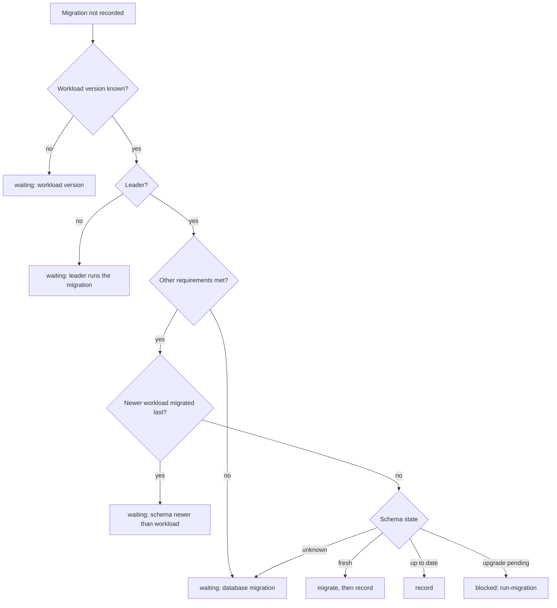

## Context

The fix for #564 (PR #647) moved the database migration check into the
holistic handler and made the database, not peer data, decide what to do: a
fresh database is migrated, an up-to-date schema is recorded, and a schema with
pending migrations waits for the `run-migration` action. The review of that fix
found problems it did not address:

- Every not-migrated state showed the same `waiting` status, also the one that
  needs an operator.
- `run-migration` failed with an empty message, and a timeout hid its cause.
- The OAuth client secret was written to the debug log, and Hydra printed the
  database password when it could not parse the connection string.
- A password with reserved characters produced an invalid connection string.
- A stopped workload with an unchanged configuration was never started, and a
  workload the charm had stopped was reported as "Failed to start".

A first version of this change was itself reviewed by three independent
reviewers. Two defects they found shaped decisions D2 and D6 below.

## Goals / Non-Goals

**Goals:**

- Tell the operator, in the unit status, when the `run-migration` action is
  needed.
- Say why a migration failed, in the log and in the action result.
- Keep the OAuth client secret and the database password out of logs, statuses
  and action results.
- Accept any database credentials.
- Run Hydra whenever its requirements are met, and report a failed start only
  when Hydra is expected to run.

**Non-Goals:**

- Storing the migration state. See D1.
- Remembering a failed automatic migration. See D3.
- Reporting a rollback as `blocked`. See D2.
- Detecting a database that was encrypted with another deployment's system
  secret. The supported recovery is the `add-secret-key` action.

## Decisions

### D1: The leader reads the schema state from the database, once per hook

The unit status for a pending migration is derived from
`hydra migrate sql status`, the same read-only check the reconciliation already
runs. The result is kept for the duration of one hook and never stored.

Alternatives considered:

- **A flag in peer data** ("upgrade pending", "migration failed"). Rejected:
  it is a cached copy of what the database already says and can go stale, for
  example after a manual migration or a leadership change.
- **Every unit asks the database.** Accurate on non-leaders too, but costs an
  exec per hook on every unit, up to the 20 s timeout each when the database is
  unreachable. Juju already shows the application as blocked when the leader
  is, and the action only runs on the leader.
- **Wording only.** No cost, but a state that needs an operator would still
  show `waiting`.

The check also runs in leader hooks that reconcile nothing, such as actions, so
that the status does not change with the kind of event. It runs only when no
other requirement is missing, because the connection settings may be
incomplete before that.

### D2: The most recent record speaks for the schema

Charmed PostgreSQL keeps the database when the integration is removed, and an
older Hydra reports a newer schema as up to date because it only knows its own
migrations. The rollback guard therefore asks which workload migrated the
database last:

- The record of the current integration, when it exists.
- Otherwise the record of the most recent earlier integration (the highest
  integration id), unless the database is fresh.

Alternatives considered:

- **Any earlier record that is newer.** This was the first implementation.
  Rejected after review: the old record is never superseded, so a rollback that
  was resolved with `run-migration` came back on every later integration and on
  every upgrade below the old version.
- **Deleting the records of removed integrations.** Rejected: `relation-broken`
  also fires on a unit that is being removed while the integration stays alive,
  so a departing leader would delete a live record.

A workload older than the schema shows `waiting`, not `blocked`: a single unit
cannot tell a rollback from a rolling upgrade in which it has not been replaced
yet.

### D3: A failed automatic migration is retried, once per hook

The retry needs no state: a database that is still fresh is migrated again on
the next event, and one that is partly migrated shows up as an upgrade pending
and waits for the action. A hook attempts the migration once, also when a
deferred event is replayed in it.

Alternatives considered:

- **Remember the failure in unit-local state.** It is lost whenever the
  container is recreated, which happens on every refresh, and it removes the
  recovery that happens by itself once the cause is fixed.
- **Fail the hook** so that Juju retries it. The unit would sit in error and
  every other event would queue behind it.

### D4: The failure reason is what Hydra printed last

The migration commands stream their output, because `ops` drops it when an exec
times out. The reason is the error Hydra exited with, or its last retry record
when it kept retrying an unreachable database until the timeout. It is bounded
to 500 characters and any connection string in it has its password masked
before it is cut. A streamed command is reported once, by its caller.

Alternative considered: a fixed message that points to the log. Rejected: the
operator running the action would still not know whether the host, the
password or the database name is wrong.

### D5: Credentials are URL-encoded in the connection string

The username and password are percent-encoded when the connection string is
built. A string of letters and digits is unchanged, so existing deployments get
a byte-identical configuration and are not restarted.

### D6: A failed start is reported when Hydra is expected to run

`WorkloadService.is_failing()` keeps its meaning: the service exists and its
readiness check has failures. The charm adds the "Failed to start the service"
status only when every requirement of the workload is met and the migration is
recorded, or when the start failed in the current hook.

Alternative considered: treat a service that Pebble reports as inactive as
"stopped on purpose". This was the first implementation. Rejected after review:
Pebble 1.16 and older, which Juju up to 3.6.0 ships, also reports a service
that exits within a second of its start as inactive, so a crashed Hydra would
have shown as active.

`PebbleService.plan()` starts the service only when it is inactive. A service
that is backing off is left to Pebble, as before this change. The error raised
when the service cannot be started or stopped carries the summary of the
failed change, without the service output that Pebble attaches.

### D7: `hydra migrate sql up`

`hydra migrate sql -e --yes` is deprecated in Hydra 25.4.0 and 26.2.0 in favour
of `hydra migrate sql up -e --yes`. Both produce the same schema on a fresh
database and on an upgrade from 25.4.0 to 26.2.0.

## Risks / Trade-offs

- [Risk] **Status change after a refresh.** Automation that waits for `waiting`
  before running `run-migration` no longer matches. → **Mitigation:** the
  change is marked **BREAKING** in the proposal and the spec, and
  `tests/integration/test_upgrade.py` accepts `blocked`.
- [Trade-off] **An exec in hooks that reconcile nothing.** While a migration is
  pending, the leader's status check costs about 0.2 s per hook, or the 20 s
  timeout when the database is unreachable.
- [Trade-off] **One lookup of the workload version per hook.** A single failed
  `hydra version` leaves the hook on "Waiting for the workload version" and the
  work happens on the next event.
- [Risk] **Streamed output with a split character.** `ops` decodes streamed
  output one websocket frame at a time, so a multi-byte character split across
  two frames makes the command time out with its output lost. → **Mitigation:**
  Hydra's output was ASCII in every case observed; the command is retried on
  the next event. `ops.testing` cannot mock a byte-mode exec, which rules out
  the byte-buffer fix for now.
- [Trade-off] **A permanently failing first migration shows `waiting`.** The
  charm keeps retrying and the log names the cause on each attempt.

## Security, Performance and Observability

- **Security:** the value of `--secret` is masked in the logged command; the
  password of a URL-encoded connection string is masked in any command output
  that is logged or returned; errors for a failed start leave out the service
  output.
- **Performance:** in the steady state nothing changes. The schema check runs
  only while the migration record is missing or differs from the workload
  version.
- **Observability:** a pending upgrade is `blocked`; a failed check is logged
  as a warning with its cause; the error line for a failed command is bounded
  to 1000 characters.
- **Database schema:** this change adds no migrations and no tables.

## Migration Plan

No data migration. The peer data layout is unchanged: the existing
`migration_version_<integration-id>` records are read as before. Rolling back
the charm revision restores the previous statuses and needs no manual step.

## Open Questions

- Should a rollback be `blocked` once every unit is known to run the older
  workload? It needs a way to see the other units' versions.
